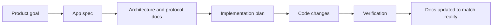

# IAM Robot Docs

This documentation set is the internal source of truth for planning and building the app.

The Markdown files in `docs/` are canonical. `Docsify` is only the presentation layer over those files.

## Current Constraint

`Next.js` is not approved for implementation yet.

Do not build:

- `apps/web`
- a web dashboard
- a docs app in `Next.js`
- a marketing site
- server routes or cloud features that require a web surface

Future `Next.js` work requires explicit user approval.

## Spec-Driven Development

Implementation should follow the spec and update the docs before the code drifts.

## Recommended Reading Order

1. [App spec](app-spec.md)
2. [Architecture overview](architecture.md)
3. [Multi-agent delivery plan](multi-agent-delivery-plan.md)
4. [Spec-driven development](process/spec-driven-development.md)
5. [AI handoff guide](ai-handoff.md)

## Documentation Areas

- [Spec](app-spec.md)
- [Architecture](architecture.md)
- [Renderer UI stack](renderer-ui-stack.md)
- [Multi-agent delivery plan](multi-agent-delivery-plan.md)
- [Process](process/spec-driven-development.md)
- [AI handoff](ai-handoff.md)
