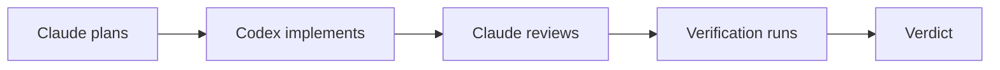

# App Spec

## Status

This is the initial working spec for the app.

It is intended to be good enough for handoff to other AI instances, not a finished product requirements document. Where decisions are still open, they should be documented rather than guessed.

Related docs:

- [Architecture overview](architecture.md)
- [Renderer UI stack](renderer-ui-stack.md)
- [Spec-driven development](process/spec-driven-development.md)
- [AI handoff guide](ai-handoff.md)

## Product Summary

Build a local-first macOS desktop app that coordinates `Codex CLI` and `Claude Code CLI` on the same coding task.

The app should:

- assign distinct roles to each agent
- run them against the same repository without file conflicts
- capture logs, diffs, approvals, and verification results
- persist local run history and settings
- enforce execution policies and safety rules

## Core Goal

The first version should prove that the app can reliably run a structured loop like:

1. planner
2. implementer
3. reviewer
4. verification
5. verdict

For the current product direction:

- `Claude` is the planner and reviewer
- `Codex` is the implementer

## Hard Scope Boundary

`Next.js` is explicitly out of scope until the user says otherwise.

Do not build:

- `apps/web`
- a `Next.js` docs site
- a `Next.js` marketing site
- a remote dashboard
- server routes or cloud sync surfaces

Future web work is allowed only after explicit user approval.

## Product Principles

- local-first by default
- desktop-first, not browser-first
- typed boundaries between UI, runtime, adapters, and persistence
- automation checks are authoritative over model agreement
- one orchestrator-controlled workflow per run
- clear auditability for prompts, outputs, commands, and results

## Recommended Stack

### Core Stack

- `Electron`
- `React`
- `TypeScript`
- `Bun`
- `Turborepo`
- `Tailwind CSS`
- `shadcn/ui`
- `tRPC`
- `Drizzle ORM`
- `SQLite`

### Renderer UI Baseline

The adopted renderer UI baseline is:

- `Tailwind CSS` in `apps/desktop` for layout, spacing, and dark theme tokens
- `shadcn` as the component authoring workflow, with shared wrappers living in `packages/ui`
- `Radix UI` primitives in `packages/ui` for dialogs, menus, tabs, tooltips, and scroll areas
- `class-variance-authority`, `clsx`, and `tailwind-merge` in `packages/ui` for typed variants and class composition
- `lucide-react` for iconography
- `react-resizable-panels` for the three-pane desktop shell layout
- `react-virtuoso` for long lists such as logs, file trees, and run history
- `xterm.js` packages for real terminal surfaces when CLI sessions are rendered in the UI

See [Renderer UI stack](renderer-ui-stack.md) for package ownership and deferred packages.

### Deferred Stack

These are intentionally deferred and must not be implemented yet:

- `Next.js`
- `Neon Postgres`
- any required cloud backend
- `monaco-editor` until an editor-grade diff or log viewer is required
- `dnd-kit` until the UI actually needs draggable tabs, cards, or workspace ordering

## System Areas

The product should be split into the following major areas:

1. desktop shell
2. local runtime
3. agent adapters
4. shared protocol and data model
5. verification engine

## Architecture

### Desktop Shell

The desktop shell should be an `Electron` app with:

- main process
- preload bridge
- renderer app

The renderer is responsible for:

- task creation
- run history
- live logs
- diff inspection
- approval prompts
- settings for CLI paths, policies, and timeouts

The renderer must not spawn subprocesses directly.

### Local Runtime

The local runtime is the core of the product and should own:

- session lifecycle
- subprocess spawning
- PTY management
- task routing
- workspace isolation
- retry and loop policy
- verification runs
- artifact collection
- final verdict generation

This should live in the Electron main process or dedicated Node workers, not in the renderer.

### Agent Adapters

Every CLI should conform to a shared adapter interface with operations like:

- `startSession`
- `sendMessage`
- `streamEvents`
- `interrupt`
- `terminate`
- `collectArtifacts`

Adapters normalize:

- stdout and stderr
- exit status
- structured handoff blocks
- file-change metadata
- retryable failure categories

Adapters should not own orchestration logic.

Phase 0 should lock the adapter boundary around shared contracts such as:

- `StartAgentSessionInput`
- `AgentSessionHandle`
- `AgentStreamEvent`
- `StructuredHandoffSpec`

### Shared Protocol

The app should define a strict internal event and state model instead of treating free-form prose as a system boundary.

Core entities:

- `Run`
- `Task`
- `AgentSession`
- `Artifact`
- `VerificationResult`
- `Verdict`
- `ApprovalRequest`

Suggested `Task` fields:

- `taskId`
- `repoPath`
- `baseBranch`
- `goal`
- `constraints`
- `acceptanceCriteria`
- `allowedPaths`
- `verificationProfile`

Suggested `Verdict` fields:

- `status`
- `summary`
- `blockingIssues`
- `proposedNextAction`
- `confidence`

Phase 0 should also expose preload-safe runtime read models such as:

- `RuntimeSnapshot`
- `RuntimeRunDetails`
- stable run and task identifiers for subscriptions and detail lookups

### Verification Engine

Verification should be based on external checks, not model consensus.

Expected checks:

- `typecheck`
- `lint`
- `tests`
- optional smoke checks
- repository policy checks

## Required Structured Handoffs

Each agent response should be normalized into machine-readable sections such as:

- `PLAN`
- `ASSUMPTIONS`
- `CHANGES`
- `RISKS`
- `REQUESTED_ACTION`

If a CLI cannot emit JSON directly, the adapter should enforce a rigid tagged format and parse it into the shared protocol model.

## Execution Model

The initial autonomous loop should be explicit and constrained:

1. `Claude` receives the task and writes a structured plan.
2. `Codex` receives the plan and makes code changes.
3. `Claude` reviews the diff, plan alignment, and likely regressions.
4. The orchestrator decides whether another implementation pass is required.
5. The verification engine runs required checks.
6. If checks fail, `Codex` receives the failure context and retries within policy.
7. The run stops on success, max retries, or a hard policy failure.

## Workspace Strategy

Multiple agents must not write to the same working tree at the same time.

Preferred approach:

- one canonical repository path
- per-run git worktrees
- per-agent branches inside a run
- orchestrator-controlled merge or cherry-pick steps

## Runtime Safety

The runtime should enforce policy boundaries from the start:

- allowed command prefixes
- allowed file paths
- max runtime per step
- max retry count
- network policy per run
- destructive action restrictions

Every run should produce an audit log with:

- prompts sent
- agent outputs
- commands executed
- files changed
- verification results
- final verdict

## Persistence

Use local `SQLite` through `Drizzle` for:

- tasks
- run metadata
- event logs
- artifacts
- diff summaries
- verification history
- approval decisions

Do not store secrets in `SQLite`. Store credentials in the macOS Keychain.

## MVP Scope

The MVP should include:

- one repo at a time
- one autonomous run at a time
- `Claude` planner and reviewer roles
- `Codex` implementer role
- git worktree isolation
- structured handoffs
- verification with `typecheck`, `lint`, and `tests`
- a final result screen with summary, diff, and logs

The MVP should exclude:

- cloud sync
- team collaboration
- arbitrary plugin execution
- more than two agent roles
- complex branch graph management
- any required web app

## Delivery Phases

### Phase 1

Build the runtime first without a polished UI. Prove that it can:

- spawn both CLIs
- hand off structured tasks
- run the planner -> implementer -> reviewer loop
- execute verification commands
- stop cleanly on success or failure

### Phase 2

Wrap the runtime in the `Electron` desktop shell and add:

- task submission
- live logs
- run history
- diff review
- settings

### Phase 3

Add productization layers:

- approval queues
- reusable verification profiles
- repo-specific policies
- failure clustering
- optional parallel subtask execution
- optional cloud sync after explicit approval

## Open Questions

These should be resolved before implementation gets deep:

- what exact protocol format should adapters emit internally: JSON events, tagged text blocks, or both?
- should the verification engine support per-repo profiles in MVP or only a single default profile?
- should the first release support only local repositories already on disk, or also guided repo selection and setup?
- how much manual approval should be required before destructive or branch-affecting actions?
- should the first runtime live entirely in the Electron main process or use worker processes from day one?
