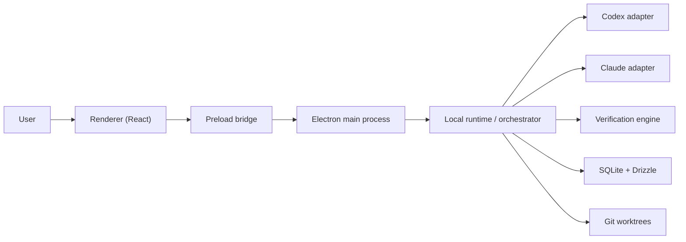
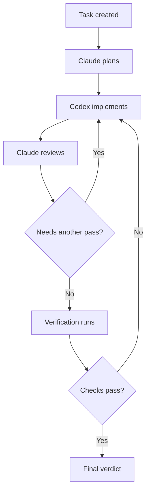

# Architecture Overview

This page summarizes the intended system shape for the first implementation phase.

## System Map

## Responsibility Boundaries

### Renderer

The renderer should handle:

- task creation
- run history
- logs and diffs
- settings
- approvals

The renderer should not spawn or manage subprocesses directly.

### Main Process And Runtime

The main process and runtime should handle:

- process lifecycle
- PTY management
- orchestration
- policy enforcement
- artifact capture
- verification

### Adapters

Adapters should translate between the shared protocol and each CLI's real behavior.

They should not decide run strategy.

## Execution Loop

## Current Constraint

The architecture is desktop-first and local-first.

`Next.js` is deferred. No web surface should be implemented unless the user explicitly approves it.
