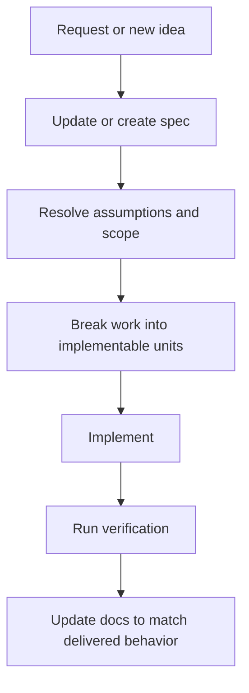

# Spec-Driven Development

## Goal

This repo should use documentation as the primary planning surface before implementation work expands.

The docs should make it easy to hand off work to different AI instances without re-deciding the product direction each time.

## Rules

1. Update the relevant spec before or alongside major implementation changes.
2. Keep the spec as plain Markdown in `docs/`.
3. Use diagrams when behavior, architecture, or state transitions are easier to understand visually.
4. Treat the docs site as a view over the specs, not as the source of truth.
5. Do not start `Next.js` implementation work until the user explicitly approves it.

## Document Types

### Product Spec

Defines:

- goal
- scope
- non-goals
- phases
- open questions

### Architecture Docs

Define:

- system boundaries
- module responsibilities
- runtime flow
- safety and verification boundaries

### Process Docs

Define:

- handoff rules
- planning order
- implementation workflow
- decision update expectations

## Delivery Flow

## Definition Of Ready

An implementation task is ready when the docs answer:

- what is being built
- what is out of scope
- which system area owns the work
- what success looks like
- what constraints apply

## Definition Of Done

A major task is done when:

- the implementation matches the spec
- verification passes
- docs reflect the delivered behavior
- unresolved follow-up questions are written down clearly

## Initial Doc Map

- [App spec](../app-spec.md)
- [Architecture overview](../architecture.md)
- [AI handoff guide](../ai-handoff.md)
